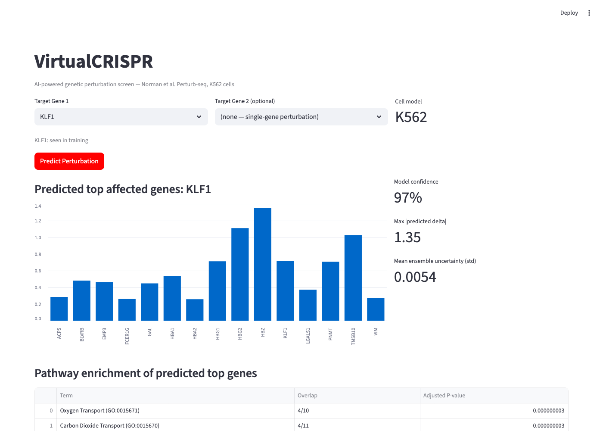
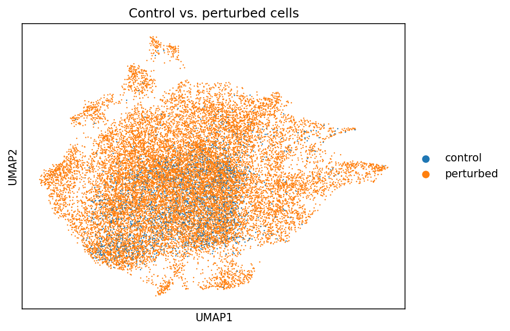
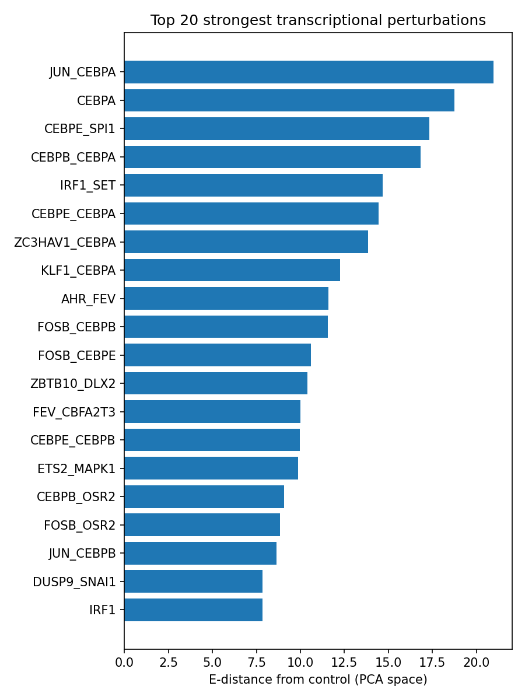
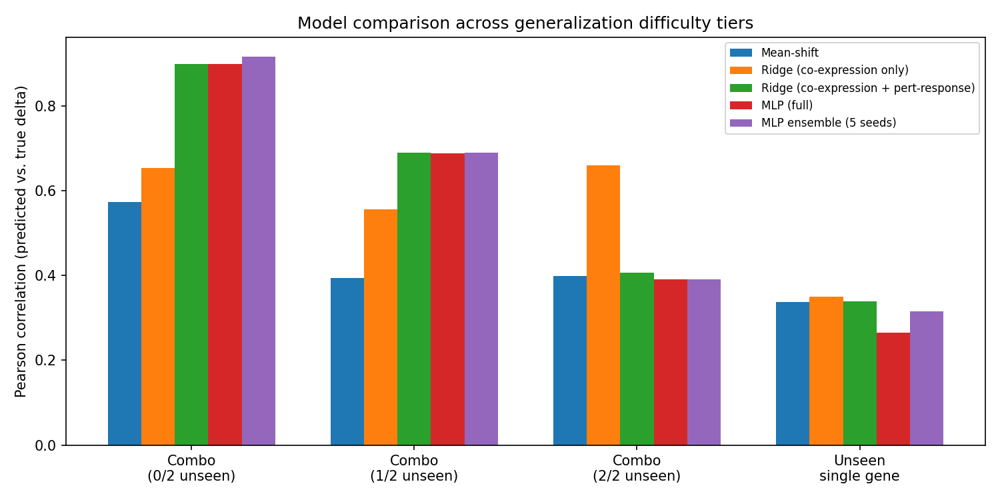

# scPerturbAI (VirtualCRISPR)

Knowledge-guided prediction and prioritization of genetic perturbations from single-cell RNA-seq.

Predicts how a K562 cell's transcriptome shifts in response to a CRISPR perturbation (single gene or gene pair) that has never been experimentally tested, using the Norman et al. Perturb-seq dataset (GSE133344), then ranks untested candidate perturbations for follow-up experiments.



*Predicting a `KLF1` perturbation (a training example, and a well-known master regulator of erythroid differentiation) correctly surfaces hemoglobin genes (`HBB`/`HBA1`/`HBA2`/`HBG1`/`HBG2`/`HBZ`) as the top affected genes, and live pathway enrichment on those genes returns "Oxygen Transport" / "Carbon Dioxide Transport" (adjusted p ≈ 3×10⁻⁹).*

## Problem

CRISPR Perturb-seq experiments reveal how perturbing a gene changes a cell's transcriptome, but exhaustively testing every gene and gene-pair combination is experimentally infeasible. This project trains a model on existing Perturb-seq data to predict transcriptional responses to unseen perturbations, then uses those predictions to prioritize which experiments are worth running next — an experiment-prioritization tool, not a replacement for wet-lab validation.

## Dataset

- Norman/Weissman Perturb-seq, K562 cells, CRISPRa ([GSE133344](https://www.ncbi.nlm.nih.gov/geo/query/acc.cgi?acc=GSE133344))
- Harmonized `.h5ad` via [scPerturb](https://www.sanderlab.org/scPerturb/) ([Zenodo record 13350497](https://zenodo.org/records/13350497))
- 111,445 cells, 237 perturbation conditions (105 single genes + 131 two-gene combinations, plus control)

## Exploratory analysis




E-distance (energy distance from control, in PCA space) ranks perturbations by transcriptional effect size. CEBPA-driven perturbations (`JUN_CEBPA`, `CEBPA`, `CEBPB_CEBPA`, `CEBPE_CEBPA`) dominate the strongest effects — consistent with CEBPA's known role as a master regulator of myeloid differentiation. Full analysis in [`notebooks/03_perturbation_analysis.ipynb`](notebooks/03_perturbation_analysis.ipynb).

## Experimental design: perturbation-level splits, not random cell splits

Cells from a given perturbation never appear in both train and test. To measure genuine generalization to novel gene combinations, a subset of genes (26 of 105) have their single-gene perturbation entirely held out of training, which lets two-gene combos be categorized by how many of their two genes were ever seen individually:

| Category | Genes individually seen in training | n perturbations |
|---|---|---|
| Train | — | 132 |
| `test_unseen_single` | 0/1 (the gene itself is unseen) | 26 |
| `test_combo_0_unseen` | 2/2 | 22 |
| `test_combo_1_unseen` | 1/2 | 51 |
| `test_combo_2_unseen` | 0/2 | 5 |

See [`src/data/splits.py`](src/data/splits.py). `test_combo_2_unseen` has only 5 perturbations — treat those results as directional, not precise.

## Gene representations

Two fully data-driven embedding sources — no external knowledge-graph or LLM download required ([`src/features/gene_embeddings.py`](src/features/gene_embeddings.py)):

1. **Co-expression embedding** — each gene's correlation profile against 500 landmark highly-variable genes on control cells, PCA-reduced to 32 dims. Available for *every* measured gene, including ones never individually perturbed — a self-contained proxy for a gene-gene functional-similarity network (the same intuition behind the STRING/co-expression priors used by GEARS/TxPert).
2. **Perturbation-response embedding** — the HVG-space pseudobulk delta induced by a gene's own single-gene perturbation, PCA-reduced to 32 dims, fit only on training singles. Zero-filled for genes without training perturbation data.

A perturbation's feature is `[sum, |diff|]` of its one or two genes' embeddings — permutation-invariant, and a single-gene perturbation is naturally represented as a gene paired with a zero vector.

## Models

- **No-perturbation** / **mean-shift** baselines ([`src/models/baseline.py`](src/models/baseline.py))
- **Ridge regression**: gene-pair embedding → expression delta
- **MLP** ([`src/models/perturbation_model.py`](src/models/perturbation_model.py)): control-cell expression (2000 HVGs) → encoder → 128-d latent, concatenated with the 128-d perturbation embedding → decoder → predicted 2000-d expression delta
- **5-seed ensemble** of the MLP, for uncertainty estimation

All models predict the population-level (pseudobulk) transcriptional shift, `Δ = mean(perturbed) − mean(control)`, not per-cell heterogeneity — a deliberate simplification given the project scope.

## Results



| Model | Combo 0/2 unseen | Combo 1/2 unseen | Combo 2/2 unseen (n=5) | Unseen single gene |
|---|---:|---:|---:|---:|
| Mean-shift | 0.573 | 0.395 | 0.398 | 0.337 |
| Ridge (co-expression only) | 0.654 | 0.556 | **0.661** | 0.349 |
| Ridge (co-expression + pert-response) | 0.898 | 0.689 | 0.406 | 0.339 |
| MLP (full embedding) | 0.899 | 0.688 | 0.392 | 0.265 |
| **MLP ensemble (5 seeds)** | **0.916** | **0.690** | 0.391 | 0.315 |

(Pearson correlation between predicted and true expression delta; full metrics including MSE, DE-restricted Pearson, and direction accuracy in [`results/tables/model_comparison.csv`](results/tables/model_comparison.csv) and [`ensemble_metrics.csv`](results/tables/ensemble_metrics.csv).)

**The embedding ablation is the most interesting finding.** Adding the perturbation-response embedding is a large win when at least one gene was individually characterized (`test_combo_0_unseen`: 0.65 → 0.90; `test_combo_1_unseen`: 0.56 → 0.69) — but on `test_combo_2_unseen`, where *neither* gene has perturbation-response data, the combined embedding does *worse* than co-expression-only (0.41 vs. 0.66). The model leans on the perturbation-response feature during training; when it's entirely absent (zero-filled) for both genes, predictions degrade below a model that never had access to it at all. This is a real, if small-*n*, illustration of why external knowledge-graph or LLM-derived gene embeddings (GEARS, Scouter, TxPert) matter: they provide informative representations even for genes that were never perturbed, which a purely data-driven embedding cannot. See [`notebooks/05_deep_learning.ipynb`](notebooks/05_deep_learning.ipynb) for the full discussion.

The deep MLP performs comparably to Ridge overall — expected given the deterministic pseudobulk-delta target, which limits how much signal the model's cell-state branch can exploit. A richer per-cell architecture (predicting single-cell response distributions, as in GEARS/scGen) would likely show a bigger advantage.

### Uncertainty tracks generalization difficulty

Mean ensemble (5-seed) prediction std by category:

| Category | Mean uncertainty |
|---|---:|
| Train | 0.0059 |
| `test_unseen_single` | 0.0062 |
| `test_combo_2_unseen` | 0.0094 |
| `test_combo_1_unseen` | 0.0082 |
| `test_combo_0_unseen` | 0.0113 |

The ensemble is appropriately less confident on the harder combo-generalization categories than on training perturbations.

### Pathway agreement (observed vs. predicted DE genes)

For 5 example perturbations, GO Biological Process enrichment (via Enrichr) on the top-50 truly DE genes vs. the top-50 genes by |predicted delta|:

| Perturbation | Category | Top-20 pathway Jaccard overlap |
|---|---|---:|
| `CEBPA` | train | 0.212 |
| `JUN_CEBPA` | combo 1/2 unseen | 0.111 |
| `DUSP9_SNAI1` | combo 0/2 unseen | 0.053 |
| `CEBPE_SPI1` | combo 2/2 unseen | 0.000 |
| `IRF1` | unseen single | 0.000 |

Full table: [`results/tables/pathway_agreement.csv`](results/tables/pathway_agreement.csv). Pathway-level agreement is modest and — as expected — highest for the training perturbation. Treat this as a directional signal: matching pathway calls from only ~50 input genes is inherently noisier than matching individual gene predictions.

## Virtual screen: prioritizing untested gene pairs

All 5,022 untested two-gene combinations from the 102-gene vocabulary are scored by predicted effect size, relevance to a target pathway (erythroid-differentiation markers, since K562 is an erythroleukemia line), and ensemble confidence:

```
Priority = predicted_effect × pathway_relevance × (1 / (1 + uncertainty))
```

Top candidates ([`results/tables/virtual_screen_top20.csv`](results/tables/virtual_screen_top20.csv)):

| Candidate | Effect | Pathway relevance | Uncertainty | Priority (0–10) |
|---|---:|---:|---:|---:|
| `IKZF3_PRDM1` | 0.909 | 0.714 | 0.022 | 10.0 |
| `CNN1_IKZF3` | 0.789 | 0.714 | 0.018 | 8.7 |
| `IKZF3_ZBTB1` | 0.785 | 0.714 | 0.016 | 8.7 |
| `IKZF3_PTPN1` | 0.783 | 0.714 | 0.017 | 8.7 |
| `IER5L_IKZF3` | 0.750 | 0.714 | 0.015 | 8.3 |

`IKZF3` (a lymphoid transcription factor) appears in most top candidates, driven by a consistently high predicted effect size — a testable hypothesis for follow-up screening, not a validated result. See [`src/screening/virtual_screen.py`](src/screening/virtual_screen.py).

## Interactive demo

```bash
streamlit run app/streamlit_app.py
```

Pick one or two genes, get predicted top-affected genes, live pathway enrichment, ensemble confidence, and the precomputed virtual-screen ranking. Ships with a small (~50MB) committed artifact bundle (`models/`) so it runs without downloading the full dataset.

## Repository structure

```
data/            dataset download instructions; raw/processed .h5ad are gitignored (regenerate via scripts/01)
notebooks/       exploration, QC, baselines, modeling, biological validation (all executed, outputs saved)
scripts/         numbered, reproducible pipeline (01 preprocess -> 10 export app artifacts)
src/data/        loading, QC, normalization, perturbation-level splits
src/features/    gene embeddings (co-expression + perturbation-response)
src/models/      baseline and deep learning perturbation models
src/evaluation/  prediction metrics (Pearson-Δ, MSE, DE-Pearson, direction accuracy)
src/biology/     differential expression + pathway enrichment
src/screening/   uncertainty ensembling + virtual-screen ranking
app/             Streamlit demo
tests/           unit tests
configs/         model/training configuration
results/         figures and tables (committed)
models/          trained model + embedding artifacts (committed, ~50MB total)
```

## Reproducing the full pipeline

```bash
python -m venv .venv && source .venv/bin/activate
pip install -r requirements.txt

# download data/norman.h5ad — see data/README.md
python scripts/01_preprocess.py          # QC, normalize, HVG, perturbation splits
python scripts/02_eda.py                 # UMAP, E-distance
python scripts/03_gene_embeddings.py     # co-expression + perturbation-response embeddings
python scripts/04_baselines.py           # no-op, mean-shift, Ridge (+ ablation)
python scripts/05_train_model.py --embedding gene_embeddings.npz --tag full --save-model
python scripts/05_train_model.py --embedding gene_embeddings_coexpr_only.npz --tag coexpr_only
for s in 11 22 33 44 55; do
  python scripts/05_train_model.py --tag ens$s --seed $s --save-model
done
python scripts/06_biology.py             # DE + pathway enrichment
python scripts/07_uncertainty.py         # ensemble uncertainty summary
python scripts/09_virtual_screen.py      # candidate ranking
python scripts/10_export_app_artifacts.py
```

## Limitations

- Single experimental system: K562 (erythroleukemia), CRISPRa, one Perturb-seq screen — not validated across cell types, perturbation modalities, or in vivo.
- Predictions approximate the population-level (pseudobulk) transcriptional shift, not per-cell heterogeneity.
- Gene embeddings are purely data-driven (co-expression + observed perturbation response); no external knowledge graph or LLM embeddings, which the ablation above suggests limits performance on genuinely unseen genes.
- `test_combo_2_unseen` has only 5 perturbations — too few for precise estimates.
- Correlation with predicted expression change is not the same as a validated mechanism or phenotype. This is an experiment-prioritization tool, not a substitute for wet-lab validation.
